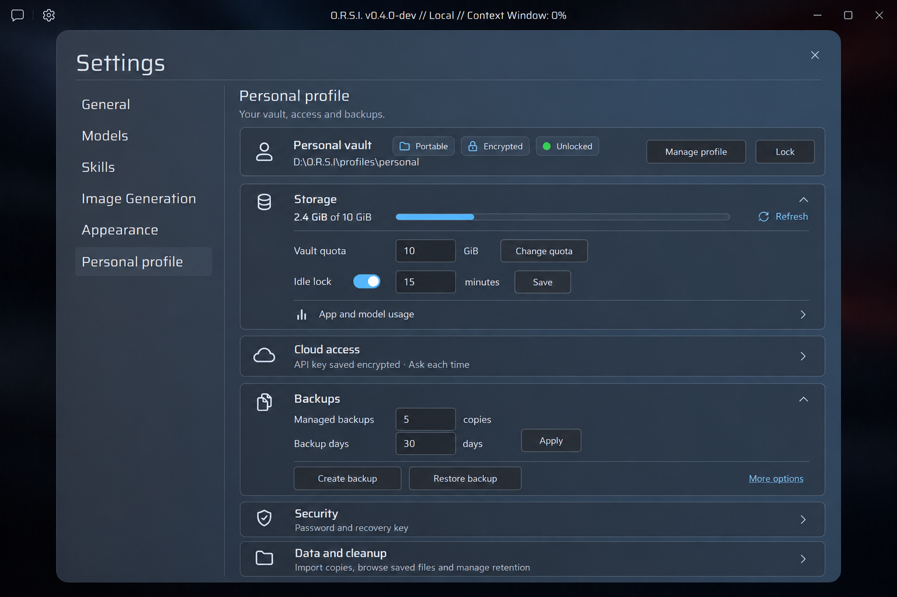
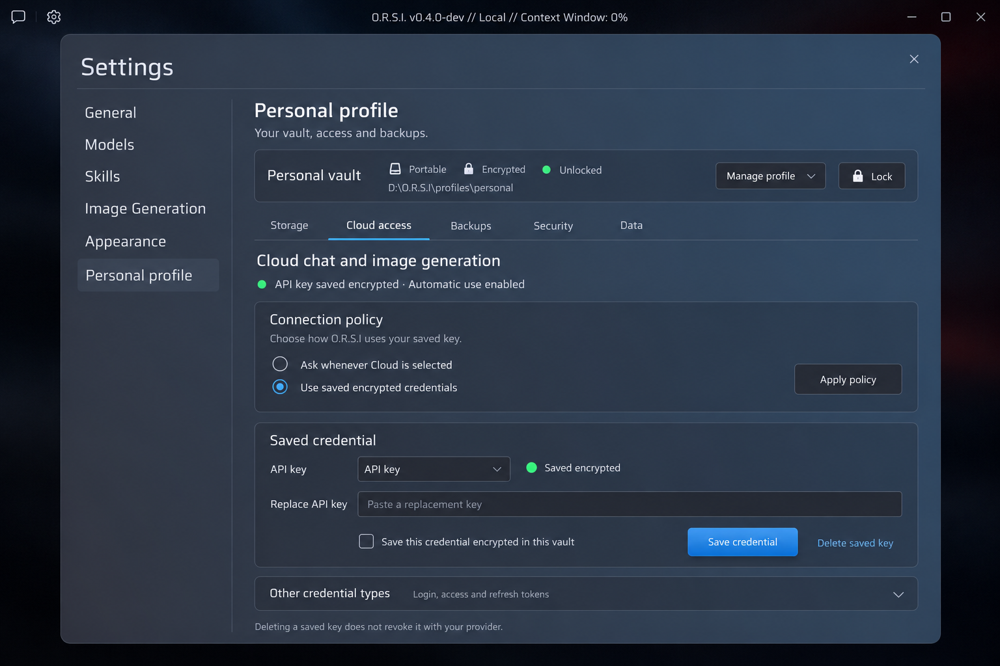

# Personal profile layout concepts

9 October 2026. The user selected **B — focused tabs**, which is now implemented
with native app controls. A remains an alternative design proposal. The compact
backup controls, login backdrop blur and slower image reveal were implemented
before this redesign. See [implementation verification](../../vault-profile-tabs-verification.md).

## Research and direction

The current page gives routine, occasional and destructive actions the same
full-width treatment. Profile creation and selection push actual settings down;
credentials, recovery, backups and saved records then form one long mixed list.
The proposals give these operations a hierarchy and a predictable place.

[Microsoft's settings guidance](https://learn.microsoft.com/en-us/windows/apps/design/app-settings/guidelines-for-app-settings)
recommends grouping related controls, aligning actions within settings rows and
revealing secondary options with expanders. The proposals apply those patterns
inside O.R.S.I.'s existing Settings window. Explicit consent, retention confirmation
and existing save semantics remain; the guidance's preference for immediate
ordinary-setting updates does not justify changing those behaviors here.

[Fluent layout guidance](https://fluent2.microsoft.design/layout) uses proximity,
consistent spacing and alignment to express relationships, and recommends reflow
for smaller windows. Use an 8-pixel layout rhythm, 16–24 pixels between sections,
36-pixel actions and 72-pixel numeric fields. Labels and units stay adjacent to
their controls. Long key/location fields may grow; action buttons should not.

[Fluent button guidance](https://fluent2.microsoft.design/components/web/react/core/button/usage/)
limits prominent primary actions and suggests quieter secondary actions when
many commands are available. Routine commands become compact neutral buttons or
text actions, with one clear save action per form. Recovery/deletion retain their
existing confirmation flows instead of competing for attention everywhere.

Keep the smoky background, blue-gray rounded panel, Saira typography and muted
input styling. The concepts use fictional state/location and no personal data.

## A — grouped overview

A slim profile summary replaces the initial stack of management buttons. Storage
and backup controls are visible in compact groups. Cloud access, security and data
open on demand. Best for seeing everyday settings together; expanding everything
can still make the page long. This concept stays closest to the current page.

## B — focused tabs (selected and implemented)

A persistent profile summary sits above five short tabs. Each page contains one
related task, removing the long mixed settings list. The mockup shows Cloud access
to demonstrate a clearer policy/save-consent/key editor. The implementation uses
this organization across all five tabs, giving credentials and saved records
enough room without stretching every action. Manage profile contains creation,
selection and current unencrypted storage; Lock stays directly accessible.

| Location | Existing controls |
| --- | --- |
| Profile summary / Manage profile | Local/portable and encryption status, location, new/select profile, legacy storage, manual lock |
| Storage | Personal usage/quota/free disk, app/model usage details, refresh, quota change, idle toggle/minutes/save, guidance preference |
| Cloud access | Connection status, Ask/saved policy, credential type, masked replacement, explicit encrypted-save consent, save/delete |
| Backups | Managed backup creation, independent backup destination, restore, count/day retention and explicit Apply |
| Security | Password change, recovery generation/export/disable, copyable location and verified relocation |
| Data | Import copies, retained-original review, saved record browsing/view/export/delete, expired-cache/draft cleanup |

At the existing 760 × 600 minimum size, keep the same section order, use shorter
tab spacing and stack form labels above controls where necessary. Scroll the
active section rather than hiding commands. Numeric inputs keep their compact
size and wheel-safe behavior. Longer guidance belongs beside the decision or
inside a disclosure, rather than in a large introductory paragraph. Zero-count
and zero-age meanings remain visible. No unsupported scheduling or auto-backup
feature is implied by either mockup.

Both 1536 × 1024 PNGs were produced with the built-in imagegen tool, using an
isolated synthetic app capture as the style reference. Exact prompts are in
[prompts.md](prompts.md). The images remain concepts. The implementation uses the
app's existing typography and native controls, with actual selected-profile state
instead of the mockup's fictional location. Each tab scrolls independently;
narrow windows reflow actions.
